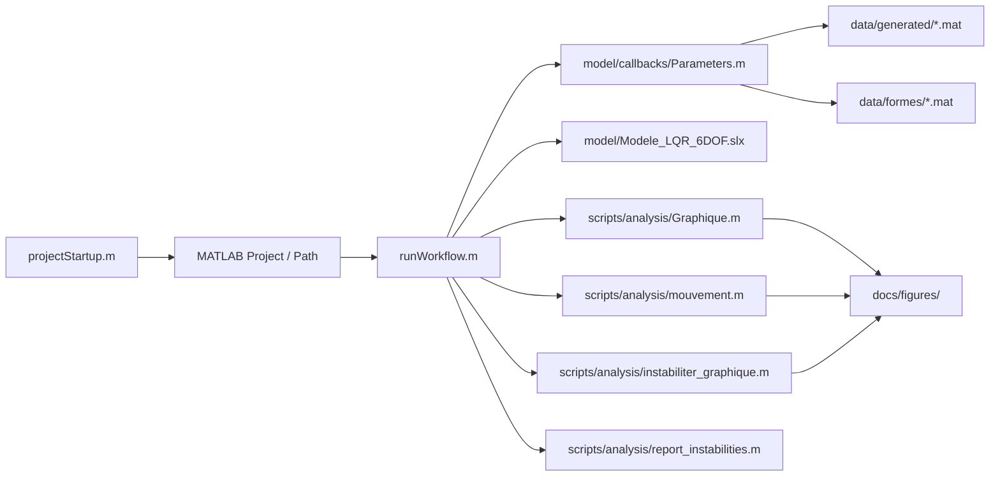

# Onboarding rapide (nouvel arrivant)

Ce guide permet a une personne qui ne connait ni MATLAB Project ni Simulink de lancer le pipeline en 15-20 minutes.

Reference structure: `PROJECT_MAP.md`.

## Carte rapide des dependances



## 1) Ouvrir le projet

1. Ouvrir MATLAB.
2. Ouvrir le dossier du depot: `C:/Programmation/ASUQTR/Matlab_Simulink`.
3. Ouvrir le projet `.prj` si MATLAB le propose (`ASUQTR_Control.prj`).

## 2) Verifier la configuration de base

- Le chemin MATLAB doit inclure au minimum:
  - `scripts/`
  - `data/formes/`
  - `data/generated/`
- Le cache Simulink peut pointer vers:
  - `sim_cache/`
  - `codegen/`

## 3) Lancer un run complet (recommande)

```matlab
opts = struct( ...
    'stopTime', 10, ...
    'runParameters', true, ...
    'runGraphique', true, ...
    'runMouvement', true, ...
    'runStability', true, ...
    'reportInstability', true, ...
    'saveFigures', true, ...
    'figureOutputDir', fullfile('docs','figures'));

simOut = runWorkflow(opts);
```

## 4) Lire les resultats

- Graphiques de position/commande: `scripts/analysis/Graphique.m`
- Animation trajectoire: `scripts/analysis/mouvement.m`
- Stabilite poles: `scripts/analysis/instabiliter_graphique.m`
- Resume instabilites: `scripts/analysis/report_instabilities.m`

## 5) Si une erreur apparait

- Verifier que `data/formes/sous marin en pentagone.mat` existe.
- Verifier que les artefacts de `data/generated/` existent (`ABmatrice.mat`, `calcul_Q.mat`, `Matrice_A_lineaire.mat`).
- Relancer `projectStartup.m`, puis `runWorkflow.m`.

## 6) Comprendre la structure

- `model/README.md`
- `scripts/README.md`
- `data/README.md`
- `docs/README.md`
- `archive/README.md`

## 7) Mini glossaire (debutant)

- `A`, `B`: matrices d'etat lineairees (dynamique et entree commande).
- `Q`, `R`: poids du regulateur LQR (compromis precision/effort de commande).
- `K`: gain de retour d'etat calcule par LQR.
- `out`: objet `Simulink.SimulationOutput` contenant les signaux de simulation.
- `poles`: valeurs propres de la dynamique en boucle fermee; si partie reelle > 0, instabilite locale.
- `data/generated`: artefacts calcules par les scripts (recalculables).
- `data/formes`: jeux de trajectoires/scenarios utilises par le modele.

Glossaire complet: `docs/glossaire.md`.
