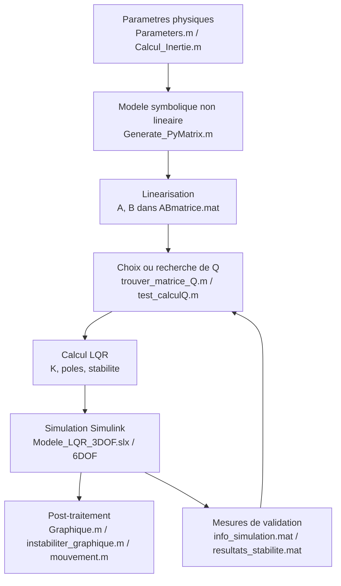

# Modelisation du controle du mini-sous-marin

Ce depot rassemble le modele mathematique, la generation des matrices d'etat, le calcul du retour LQR et les scripts de validation/visualisation utilises autour des modeles Simulink.

Je ne detaille pas le contenu interne des fichiers `.slx`, mais ce README explique le pipeline MATLAB qui alimente la simulation et l'analyse.

## Vue d'ensemble

Le flot principal est le suivant :

1. Definir les parametres physiques du vehicule.
2. Construire le modele symbolique non lineaire du sous-marin.
3. Lineariser le modele pour obtenir les matrices `A` et `B`.
4. Construire ou ajuster la matrice de cout `Q` du regulateur.
5. Calculer le gain `K` du LQR et verifier la stabilite.
6. Exploiter les resultats de simulation pour visualiser la trajectoire, les commandes et la stabilite.

Les fichiers `.mat` et `.txt` du depot servent souvent d'etapes intermediaires entre ces scripts.

### Schema global



### Principe mathematique

Le projet utilise un modele d'etat du sous-marin sous la forme generale :

$$
\dot{x} = f(x,u)
$$

avec un vecteur d'etat typique :

$$
x = [x, y, z, \phi, \theta, \psi, u, v, w, p, q, r]^T
$$

La dynamique est composee de plusieurs blocs :

- cinematique de pose;
- inertie rigide;
- masse ajoutee;
- Coriolis et effets gyroscopiques;
- gravite et flottabilite;
- amortissement lineaire et quadratique;
- allocation des poussées des 8 propulseurs.

La linearisation autour d'un point d'equilibre donne :

$$
\delta\dot{x} = A\,\delta x + B\,\delta u
$$

Le retour d'etat LQR cherche ensuite un gain :

$$
u = -Kx
$$

en minimisant une fonction de cout de type :

$$
J = \int_0^{\infty} (x^TQx + u^TRu)\,dt
$$

Le choix de $Q$ et $R$ determine donc le compromis entre precision de suivi, effort moteur et stabilite.

## Scripts centraux

### `Generate_PyMatrix.m`

Ce script construit le modele symbolique complet du sous-marin.

Il definit notamment :

- les etats symboliques `x, y, z, roll, pitch, yaw, u, v, w, p, q, r`;
- les parametres de masse, d'inertie, de flottabilite et d'amortissement;
- la matrice d'inertie rigide `Mrb`;
- la matrice de masse ajoutee `Ma`;
- les matrices de damping lineaire et quadratique;
- la matrice de Coriolis;
- la matrice de gravite `G`;
- l'allocation de poussée des 8 propulseurs.

Ensuite, le script linearise le modele autour de l'etat considere et calcule :

- `A` : jacobienne par rapport aux etats;
- `B` : jacobienne par rapport aux commandes.

Sorties principales :

- `ABmatrice.mat` contenant `A` et `B`;
- `Matrix_centrer.txt` contenant une version texte des matrices et du vecteur de gravite.

#### Ce que calcule vraiment le script

1. Il assemble la matrice d'inertie totale `M = Mrb + Ma`.
2. Il construit la matrice de Coriolis `C` a partir de `M` et de l'etat courant.
3. Il construit les matrices d'amortissement `D`.
4. Il calcule la gravite `G`.
5. Il forme le modele non lineaire `F_dot`.
6. Il calcule ensuite les jacobiennes par rapport a l'etat et a la commande pour obtenir `A` et `B`.

Le point important pour l'analyse GPT est que ce fichier ne fait pas seulement un calcul numerique: il formalise le modele dynamique complet du systeme.

### `Parameters.m`

Ce script rassemble les parametres numeriques utilises par la modelisation et le controle.

On y retrouve :

- la geometrie du sous-marin;
- la position du centre de gravite et du centre de flottabilite;
- les inerties principales;
- la masse, le poids et la poussee;
- les positions et directions des 8 propulseurs;
- le chargement de `calcul_Q.mat` et de `Matrice_A_lineaire.mat`;
- la selection de la matrice `Q` a envoyer au bloc de controle.

Ce fichier sert donc de point d'entree pour centraliser les constantes physiques du systeme.

#### Role dans l'architecture

Ce script est le meilleur endroit pour verifier si une anomalie vient d'une hypothese physique plutot que d'un probleme de controle.

Par exemple, si les poles deviennent absurdes ou si les efforts moteurs explosent, les causes a investiguer sont souvent :

- masse ou inertie mal estimee;
- centre de gravite / flottabilite incoherent;
- directions de propulseurs mal codees;
- force maximale trop optimiste ou trop faible.

### `calcul_matrice_A_lineaire.m`

Ce script prend `ABmatrice.mat` et evalue numeriquement la matrice `A` au point d'operation choisi.

Il charge aussi `calcul_Q.mat`, construit `Q`, puis calcule un LQR avec `lqr(A_num, B_num, Q_final, R)`.

Il produit aussi les poles en boucle fermee et sauvegarde `Matrice_A_lineaire.mat`.

#### Calcul effectue

Ce script prend la matrice symbolique `A` et la specialise en un point de fonctionnement donne en remplacant les variables symboliques par des valeurs numeriques.

Le resultat est la forme exploitable pour le calcul de controleurs lineaires classiques.

Dans le contexte du projet, cela sert surtout a comparer :

- le comportement local du modele;
- la stabilite avec la commande LQR;
- l'impact du choix de `Q` et `R` sur les poles.

### `trouver_matrice_Q.m`

Ce script cherche une matrice `Q` a partir d'une reponse de simulation contenue dans `info_simulation.mat`.

L'idee generale est de :

- extraire les amplitudes max/min des etats;
- construire une forme de penalisation adaptee;
- obtenir `Q_final` pour le calcul LQR.

Il s'agit donc du script de conception/ajustement de `Q`.

#### Logique de calcul

Le script essaie de deduire des penalites a partir d'une simulation precedente.

L'idee est simple : si certains etats deviennent trop grands dans une reponse de simulation, il est logique de les penaliser davantage dans `Q` afin de forcer le regulateur a les maintenir proches de zero.

Ce n'est pas une optimisation mathematique formelle unique, mais plutot une strategie empirique guidee par les resultats de simulation.

### `test_calculQ.m`

Version de test du calcul LQR.

Le script :

- charge `ABmatrice.mat`;
- charge `calcul_Q.mat`;
- convertit `A` et `B` en numerique;
- calcule `K` avec `lqr`;
- trace les poles du systeme;
- permet de verifier rapidement que le choix de `Q` et `R` donne un comportement stable.

#### Pourquoi ce test est utile

Ce fichier sert de test de coherence entre le modele lineaire, la matrice de cout et la stabilite du retour d'etat.

Si `lqr` produit un gain incoherent ou si les poles restent mal places, cela indique qu'il faut revoir soit `Q`, soit `R`, soit le point de linearisation, soit la qualite de `A` et `B`.

### `testFinale.m`

Script d'essai pour generer des trajectoires de reference et verifier la reponse XY/Z du systeme.

Il utilise les sorties de simulation `out` pour tracer la position, le temps, et les efforts moteurs.

#### Lecture de ce script

Ce script est surtout un script de validation visuelle de fin de chaine.

Il permet de verifier si la trajectoire obtenue correspond a la consigne et si les moteurs restent dans une plage acceptable.

## Utilitaires et scripts secondaires

### `Calcul_Inertie.m`

Calcule une estimation de l'inertie totale du sous-marin a partir de la masse des moteurs et de leur position.

Ce script sert de support pour justifier ou recouper les valeurs d'inertie utilisees dans la modelisation.

### `setax.m`

Petit utilitaire de visualisation 3D.

Il trace un objet deforme/translater dans une figure MATLAB et fixe les limites des axes.

### `Graphique.m`

Script de post-traitement des resultats de simulation.

Il recupere les signaux de position, les commandes moteurs et les cibles, puis trace :

- la trajectoire XY;
- la position en fonction du temps;
- la position selon `z`;
- des repere de cible pour differents tests.

#### Ce qu'il apporte pour l'analyse

Il donne une vue pratique de la reponse du systeme, en particulier :

- erreur de suivi en XY;
- comportement vertical;
- excitation des moteurs;
- qualite de convergence vers la cible.

### `instabiliter_graphique.m`

Script d'analyse de stabilite a partir de signaux Simulink.

Il calcule les poles instantanes d'une boucle fermee, trace leur evolution et signale les instabilites locales.

#### Interpretation

Ce script est utile pour un probleme de controle variable dans le temps ou pour diagnostiquer un changement brutal de dynamique pendant une simulation.

Le critere principal est simple: si une partie reelle des poles passe au dessus de zero, la stabilite locale est compromise.

### `signal_de_controle.m`

Script simple de generation de signaux d'entree de test pour la commande.

### `mouvement.m`

Script de visualisation du mouvement du systeme, probablement utilise pour produire des figures a partir des sorties `out`.

## Fichiers de donnees et artefacts generes

Les scripts precedent produisent ou consomment souvent les fichiers suivants :

- `ABmatrice.mat` : matrices symboliques `A` et `B`;
- `Matrice_A_lineaire.mat` : matrice `A_num` numerique;
- `calcul_Q.mat` : matrice `Q_final` retenue;
- `K_LQR.mat` : gain LQR sauvegarde;
- `info_simulation.mat` : resultats de simulation;
- `resultats_stabilite.mat` : resultats d'analyse de stabilite;
- `Q_test1.mat`, `Q_test2.mat`, `Q_test3.mat` : variantes de test pour `Q`;
- `signal1_test.mat` : signaux de test;
- `Matrix_centrer.txt` : export texte des matrices linearisées.

## Modele Simulink

Les fichiers `.slx` representent la partie bloc du projet :

- `Modele_LQR_3DOF.slx`;
- `Modele_LQR_6DOF.slx`;
- `LQR block.slx`;
- `untitled.slx.autosave`.

Ils utilisent vraisemblablement les matrices et parametres prepares par les scripts MATLAB pour simuler le comportement du sous-marin avec retour d'etat.

## Sequence d'utilisation conseillee

Une sequence typique est la suivante :

1. Verifier ou recalculer les parametres physiques dans `Parameters.m` et/ou `Calcul_Inertie.m`.
2. Generer les matrices symboliques avec `Generate_PyMatrix.m`.
3. Convertir/lineariser le modele numerique avec `calcul_matrice_A_lineaire.m`.
4. Construire ou ajuster `Q` avec `trouver_matrice_Q.m` ou un script de test equivalent.
5. Valider le gain LQR avec `test_calculQ.m`.
6. Lancer les simulations Simulink et analyser les sorties avec `Graphique.m` ou `instabiliter_graphique.m`.

## Pistes d'amelioration a documenter ou tester

Pour un GPT qui doit aussi evaluer les ameliorations possibles, les points suivants meritent d'etre explicitement documentes ou experimentes :

- comparer plusieurs points de linearisation au lieu d'un seul;
- tester plusieurs matrices `Q` et `R` avec des criteres explicites;
- verifier la sensibilite aux masses, inerties et coefficients de damping;
- separer plus clairement les fichiers d'initialisation, de calcul, de validation et de visualisation;
- tracer automatiquement les poles, les erreurs de suivi et l'effort moteur pour chaque essai;
- documenter le lien exact entre les fichiers `.mat` intermediaires et les blocs Simulink;
- expliciter si la commande agit sur des consignes de force, de couple ou sur des vitesses moteur;
- preciser la convention de signe pour chaque axe et chaque propulseur.

## Ce qu'un GPT devrait retenir

- `Generate_PyMatrix.m` est le coeur mathematique du projet.
- `Parameters.m` fixe les hypotheses physiques et les constantes du systeme.
- `calcul_matrice_A_lineaire.m` rend le modele exploitable pour l'analyse lineaire et le LQR.
- `trouver_matrice_Q.m` et `test_calculQ.m` servent a regir le compromis performance / stabilite / effort.
- `Graphique.m`, `mouvement.m` et `instabiliter_graphique.m` servent a confirmer que la commande fonctionne en simulation.
- Les fichiers `.slx` orchestrent l'execution, mais l'intelligence du projet se trouve surtout dans les scripts MATLAB et les fichiers de donnees intermediaires.

## Points a retenir

- `Parameters.m` et `Generate_PyMatrix.m` portent le coeur de la modelisation.
- `calcul_matrice_A_lineaire.m` transforme le modele symbolique en base numerique exploitable pour le controle.
- `trouver_matrice_Q.m` et `test_calculQ.m` servent a concevoir et valider la matrice de cout du LQR.
- Les scripts `Graphique.m`, `mouvement.m` et `instabiliter_graphique.m` sont surtout des outils d'analyse et de presentation des resultats.
- Les fichiers `.slx` completent la chaine de simulation, mais ce document reste volontairement au niveau MATLAB.

## Annexe code source

Les blocs ci-dessous recopient les scripts MATLAB les plus importants afin de garder dans un seul document le contexte, la logique et l'implementation.

### `Parameters.m`

```matlab
% REF
%     Q_elements = [1 1 4 4 1 1 3 3 3 4 4 4];
%     Q = diag(Q_elements);
%     R_elements = [0.001 0.001 0.001 0.001 0.001 0.001 0.001 0.001];
%     R = diag(R_elements);
	%Q_elements = [0.000001 0.000001 1.5 1 1 1 1 1 1 0.0001 0.0001 0.0001];
	%Q = diag(Q_elements);
	%R_elements = [0.01 0.01 0.01 0.01 0.01 0.01 0.01 0.01];
	%R = diag(R_elements);
	%Amatrix = zeros(12,12);
	%Bmatrix = zeros(12,8);
	%X0 = 0;
close all
%% ------------------------------ Parameters ------------------------------
%rg_b = [0 0 0.02 ]; [m]  % location of the CG (center of gravity) with respect to CO (') (0, 0,0)
x_rg = 0;
y_rg = 0;
z_rg = 0;

%rb_b = [0 0 0]; [m] % location of CB (center of buoyancy) with respect to CO
x_rb = 0;
y_rb = 0;
z_rb = 0;

%I_b = [0.16 0.16 0.16].'; [kg*m^2] % inertia tensor where the body axes coincide with the principal axes of inertia or the longitudinal

% inertie trouvé ancien
I_x = 0.578;
I_y = 0.645;
I_z = 0.9366;


% calculé Émile
% I_x = 0.5380;
% I_y = 0.5057;
% I_z = 0.5432;

% original
% I_x =  0.16; % original (0.16)
% I_y =  0.16; % original (0.16)
% I_z =  0.16; % original (0.16)

%m = 11.5; % mass [kg]
%g = 9.81; %acceleration of gravity
%W = 112.8; % weight W = m*g [N]
%B = 114.8; % buoyancy [N]
water_density = 1000.0;
radius = 0.26;
m = 23.9; % original (2.8)
g = 9.81;
W = m*g;
B = -W;

%% ---------------------------------Actuators------------------------------
%syms angle_motors = pi/4
% longeur[m]

% lx1 =  0.2987;  % original (0.2987)
% ly1 =  0.2130; % original (0.2130)
% lz1 =  0; % original (0)
% 
% lx2 =  0.2987; % original (0.2987)
% ly2 =  -0.2130; % original (-0.2130)
% lz2 =  0.16; % original (0.16)
% 
% lx3 = -0.1073; % original (-0.1073)
% ly3 =  0.2725; % original (0.2725)
% lz3 =  0; % original (0)
% 
% lx4 = -0.1073; % original (-0.1073)
% ly4 = -0.2725; % original (-0.2725)
% lz4 =  0.300193; % original (0)
% 
% lx5 =  0.1073; % original (0.1073)
% ly5 =  0.2725; % original (0.2725)
% lz5 =  0.16; % original (0.16)
% 
% lx6 = 0.1073; % original (0.1073)
% ly6 = -0.2725; % original (-0.2725)
% lz6 = 0; % original (0)
% 
% lx7 =  -0.2987; % original (-0.2987)
% ly7 =  0.2130; % original (0.2130)
% lz7 =  0; % original (0)
% 
% lx8 =  -0.2987; % original (-0.2987)
% ly8 = -0.2130; % original (-0.2130)
% lz8 =  0; % original (0)

% calculé
lx1 = 0.0194; ly1 = 0.0381; lz1 = 0.0575;
lx2 = 0.0194; ly2 = -0.0381; lz2 = 0.0575;
lx3 = -0.0317; ly3 = 0.0049; lz3 = 0.0366;
lx4 = -0.0317; ly4 = -0.0049; lz4 = 0.0366;
lx5 = 0.0317; ly5 = 0.0049; lz5 = 0.0366;
lx6 = 0.0317; ly6 = -0.0049; lz6 = 0.0366;
lx7 = -0.0194; ly7 = 0.0381; lz7 = 0.0575;
lx8 = -0.0194; ly8 = -0.0381; lz8 = 0.0575;

% force = 65.7
force = 20;
% force = 1;
%F1cos(pi/4);
%-F1sin(pi/4);


Fx1 = -0.7071*force; Fy1 =  0.7071*force; Fz1 = 0;
Fx2 = -0.7071*force; Fy2 = -0.7071*force; Fz2 = 0;

Fx3 = 0; Fy3 = 0; Fz3 = -1*force;
Fx4 = 0; Fy4 = 0; Fz4 = -1*force;
Fx5 = 0; Fy5 = 0; Fz5 = -1*force;
Fx6 = 0; Fy6 = 0; Fz6 = -1*force;

Fx7 =  0.7071*force; Fy7 =  0.7071*force; Fz7 = 0;
Fx8 =  0.7071*force; Fy8 = -0.7071*force; Fz8 = 0;


load("calcul_Q.mat","Q_final");
load("Matrice_A_lineaire","A_num")
% load("calcul_Q_possible3.mat","Q_final");
Q_envoyer = Q_final(:,:,1);
```

### `Generate_PyMatrix.m`

```matlab
clear all
close all
clc
%% Note
%Remplacer les ^ par des ** dams le .txt
%cos(roll_) -> cos_roll
%cos(pitch_) -> cos_pitch
%cos(yaw_) -> cos_yaw

%sin(roll_) -> sin_roll
%sin(pitch_) -> sin_pitch
%sin(yaw_) -> sin_yaw

%tan(roll_) -> tan_roll
%tan(pitch_) -> tan_pitch
%tan(yaw_) -> tan_yaw

%% Parameters
    
	syms x y z roll_ pitch_ yaw_ u v w p q r du0 du1 du2 du3 du4 du5 du6 du7 % state and control input
    
	syms mass Ix Iy Iz Ixy Ixz Iyz mzg %Mrd matrix
    
	syms Xu_dot Yv_dot Zw_dot Kp_dot Mq_dot Nr_dot Xq_dot Yp_dot % Ma matrix
    
	syms Xu Xuu Yv Yvv Zw Zww Kp Kpp Mq Mqq Nr Nrr % Damping matrices
    
	syms gx gy gz bx by bz gravity radius water_density % G matrix
    
	% Position du sous-marin
	pose = [x y z roll_ pitch_ yaw_];
    
	%Vitesse du sous-marin
	vel = [u v w p q r];
    
	% Vecteur d'�tat du sous-marin
	state = sym(zeros(12,1));
	state(1:6) = transpose(pose);
	state(7:12) = transpose(vel);
    
	% Throttle des moteurs symbolique
	du = [du0; du1; du2; du3; du4; du5; du6; du7];
    
	% Centre de gravit� et de flottabilit� symbolique
	gravity_center = [gx gy gz];
	buoyancy_center = [bx by bz];

	% Rigid body inertia matrix Page 66 ou 192
	Mrb = sym([ mass,  0.0,  0.0,  0.0,  0.0,  0.0;
				0.0,  mass,  0.0,  0.0,  0.0,  0.0;
				0.0,   0.0, mass,  0.0,  0.0,  0.0;
				0.0,   0.0,  0.0,   Ix,  -Ixy,  -Ixz;
				0.0,   0.0,  0.0,  -Ixy,   Iy,  -Iyz;
				0.0,   0.0,  0.0,  -Ixz,  -Iyz,   Iz]);
            
	% Added mass matrix Page 11
	Ma = sym([  -Xu_dot,     0.0,    0.0,     0.0,     0.0,   0.0;
				0.0,     -Yv_dot,    0.0,     0.0,     0.0,   0.0;
				0.0,        0.0, -Zw_dot,     0.0,     0.0,   0.0;
				0.0,        0.0,    0.0,  -Kp_dot,     0.0,   0.0;
				0.0,        0.0,    0.0,     0.0,  -Mq_dot,   0.0;
				0.0,        0.0,    0.0,     0.0,     0.0, -Nr_dot]);
                
	linear_damping = sym([  -Xu, 0.0, 0.0, 0.0, 0.0, 0.0;
							0.0, -Yv, 0.0, 0.0, 0.0, 0.0;
							0.0, 0.0, -Zw, 0.0, 0.0, 0.0;
							0.0, 0.0, 0.0, -Kp, 0.0, 0.0;
							0.0, 0.0, 0.0, 0.0, -Mq, 0.0;
							0.0, 0.0, 0.0, 0.0, 0.0, -Nr]);
                        
                        
                        
	quadratic_damping = sym([ -Xuu,  0.0,  0.0,  0.0,  0.0,  0.0;
							   0.0, -Yvv,  0.0,  0.0,  0.0,  0.0;
							   0.0,  0.0, -Zww,  0.0,  0.0,  0.0;
							   0.0,  0.0,  0.0, -Kpp,  0.0,  0.0;
							   0.0,  0.0,  0.0,  0.0, -Mqq,  0.0;
							   0.0,  0.0,  0.0,  0.0,  0.0, -Nrr]);
                           
	thrust_position = [    0.2987,  0.2130, 0;  %thruster 1
						   0.2987, -0.2130, 0;  %thruster 2
						  -0.1073,  0.2725, 0;  %thruster 3
						  -0.1073, -0.2725, 0;  %thruster 4
						   0.1073,  0.2725, 0;  %thruster 5
						   0.1073, -0.2725, 0;  %thruster 6
						  -0.2987,  0.2130, 0;  %thruster 7
						  -0.2987, -0.2130, 0]; %thruster 8
     
	thrust_direction = [     -0.707,   0.707,    0;   %thruster 1
							 -0.707,  -0.707,    0;   %thruster 2
							 0.0,      0.0,      -1;   %thruster 3
							 0.0,      0.0,      -1;   %thruster 4
							 0.0,      0.0,      -1;   %thruster 5
							 0.0,      0.0,      -1;   %thruster 6
							 0.707,    0.707,    0;   %thruster 7
							 0.707,   -0.707,    0];  %thruster 8
                       
	  %% Dynamics
	  M = sym(Mrb + Ma);
      
	  C = sym(coriolisMatrix(M,state));
      
	  D = sym(linear_damping + quadratic_damping);
      
	  G = sym(gravityMatrix(state, mass, gravity, radius, water_density, gravity_center, buoyancy_center));
      
	  %Non-linear dynamics funciton f (state-space)
	  %Page 138 of computer-aided Control System Design, Chin 2013
      
	  f1 = sym(zeros(12,12));
	  f1(1:6,7:12) = J(state);
	  f1(7:12,7:12) = -inv(M)*(C - D);
      
	  f2 = sym(zeros(12,1));
	  f2(7:12,1) = -inv(M)*G;
      
	  f = f1*state + f2;
      
	  %% Control
	  thrust_allocation = zeros(8,6);
	  thrust_allocation(1:8,1:3) = thrust_direction; %map XYZ Froces
      
	  for i = 1:8
		   thrust_allocation(i,4:6) = cross(thrust_position(i,1:3),thrust_direction(i,1:3)); %maps XYZ torques
	  end
      
	  thrust_allocation = transpose(thrust_allocation);
      
	  %control input u
	  u_control = sym(zeros(1,6));
      
	  for i = 1:8
		  u_control(i) = du(i)*abs(du(i));
	  end
      
	  tau = thrust_allocation*transpose(u_control);
      
	  %control function g
	  %page 138 of computer-aided Control System Design, Chin 2013
	  g = sym(zeros(12,1));
	  g(7:12,1) = M\tau;
      
	  %% State space
      
	  %non-linear state space model F_dot
	  F_dot = sym(zeros(12,1));
      
	  for i = 1:length(f)
		  F_dot(i,1) = f(i,1) + g(i,1);
	  end

%This function populates the symbolic state space model with the robot's
%actual parameters, and generates the lqr cost matrices

syms x y z roll_ pitch_ yaw_ u v w p q r du0 du1 du2 du3 du4 du5 du6 du7 radius

%Gravity matrix parameters
% displaced_water_volume = 0.045;
% displaced_water_volume = 0.01; 
displaced_water_volume = 0.01;
water_density = 1000.0;
gx = 0;
gy = 0;
gz = 0;
bx = 0;
by = 0;
bz = 0;
gravity = 9.81;

%Mass matrix parameters
mass = 23.9; % original (28)
Ix = 0.578; % original (0.35)
Iy = 0.645; % original (0.36)
Iz = 0.937; % original (0.62)
Ixy = 0;
Ixz = 0;
Iyz = 0;
mzg = mass*abs(gz);

% Added mass matrix parameters

added_mass = water_density*displaced_water_volume;
mass_ratio = added_mass/mass;
Xu_dot = mass_ratio*mass;
Yv_dot = mass_ratio*mass;
Zw_dot = mass_ratio*mass;
Kp_dot = mass_ratio*Ix;
Mq_dot = mass_ratio*Iy;
Nr_dot = mass_ratio*Iz;
Xq_dot = mass_ratio*mzg;
Yp_dot = mass_ratio*mzg;

% Damping matrix parameters

	% Linear Damping
	Xu = 4.03;
	Yv = 6.22;
	Zw = 5.15; % original (-5.15)
	Kp = 0.07;
	Mq = 0.07;
	Nr = 0.07;
    
	% Quadratic Damping
	Xuu = 18.18;
	Yvv = 21.66;
	Zww = 36.99;
	Kpp = 1.55;
	Mqq = 1.55;
	Nrr = 1.55;
    
% Substitute constant parameters
state_dot = subs(F_dot);
G = subs(G);

% rayon

radius = 0.26;
% The system is linearized via the jacobian
df_dstate = jacobian(state_dot,state);
A = df_dstate;
df_dcontrol(du0, du1, du2, du3, du4, du5, du6, du7) = jacobian(state_dot,transpose(du));
df_dcontrol = df_dcontrol(1, 1, 1, 1, 1, 1, 1, 1);
B = df_dcontrol;
% Gravity matrix G

save("ABmatrice","A","B")


%% Print in TXT file

fid = fopen( 'Matrix_centrer.txt', 'wt' );
% A matrix
for i = 1:12
	for j = 1:12
	fprintf( fid, 'Am[%1.0f][%1.0f] = %s\n',i-1,j-1, char(vpa(df_dstate(i,j))));
	end
end
fprintf(fid,'\n\n\n');
for i = 1:12
	for j = 1:8
	fprintf( fid, 'Bm[%1.0f][%1.0f] = %s\n',i-1,j-1, char(vpa(B(i,j))));
	end
end
fprintf(fid,'\n\n\n');
for i = 1:6
  fprintf( fid, 'Gm[%1.0f] = %s\n',i-1, char(vpa(G(i))));
end
fclose(fid);

%% Sub-functions

function [ret] = s(vec)
% Creates the 3x3 anti-symmetric matrix from a 3 elements input vector
% page 20 of handbook of marine craft Fossen 2011
	ret = [    0.0, -vec(3),  vec(2);
			vec(3),     0.0, -vec(1);
		   -vec(2),  vec(1),    0.0];
end

function [C] = coriolisMatrix(M,state)
	v1 = state(7:9);
	v2 = state(10:12);
    
	s1 = s(M(1:3,1:3)*v1 + M(1:3,4:6)*v2);
	s2 = s(M(4:6,1:3)*v1 + M(4:6,4:6)*v2);
	C = sym(zeros(6,6));
	C(1:3,4:6) = -s1;
	C(4:6,1:3) = -s1;
	C(4:6,4:6) = -s2;

end

function [G] = gravityMatrix(state,mass,gravity,radius,water_density,gravity_center,buoyancy_center)
%create the gravity matrix Page 60 of handbook of marine craft 2011

	[phi, theta, psi] = deal(state(4), state(5), state(6));
    
	%weight, W and buoyancy force, F
	W = mass*gravity; %Newton
    
	F_buoyancy = ((4/3)*pi*radius^3)*water_density*gravity;
    
	%Gravity center position in the robot fixed frame (gx, gy, gz) [m]
	gx = gravity_center(1);
	gy = gravity_center(2);
	gz = gravity_center(3);
    
	%Gravity center position in the robot fixed frame (bx, by, bz) [m]
	bx = buoyancy_center(1);
	by = buoyancy_center(2);
	bz = buoyancy_center(3);
    
	G = [(W - F_buoyancy)*sin(theta);
		- (W - F_buoyancy)*cos(theta)*sin(phi);
		- (W - F_buoyancy)*cos(theta)*cos(phi);
		-(gy*W - by*F_buoyancy)*cos(theta)*cos(phi) + (gz*W - bz*F_buoyancy)*cos(theta)*sin(phi);
		(gz*W - bz*F_buoyancy)*sin(theta) + (gx*W - bx*F_buoyancy)*cos(theta)*cos(phi);
		-(gx*W - bx*F_buoyancy)*cos(theta)*sin(phi) - (gy*W - by*F_buoyancy)*sin(theta)];
    
end
      
function [ret] = J(state)
% Transforms from BODY to NED coordinates Page 26 of Handbook of marine
% craft 2011
	[phi, theta, psi] = deal(state(4), state(5), state(6));
    
	%The velocity is transformed from BODY to NED cooridinate system
	vel_NED = [cos(psi)*cos(theta), -sin(psi)*cos(phi)+cos(psi)*sin(theta)*sin(phi),  sin(psi)*sin(phi)+cos(psi)*cos(phi)*sin(theta);
			   sin(psi)*cos(theta), cos(psi)*cos(phi) + sin(phi)*sin(theta)*sin(psi), sin(theta)*sin(psi)*cos(phi) - cos(psi)*sin(phi);
			   -sin(theta),         cos(theta)*sin(phi),                              cos(theta)*cos(phi)];
	%Angular velocity is transformed from body to NED coordinate system
	angular_vel_NED = [ 1.0, sin(phi)*tan(theta), cos(phi)*tan(theta);
						0.0, cos(phi), -sin(phi);
						0.0, sin(phi)/cos(theta), cos(phi)/cos(theta)];
                    
	[ret] = sym(zeros(6,6));
    
	ret(1:3,1:3) = vel_NED;
	ret(4:6,4:6) = angular_vel_NED;
    
end
```

### `calcul_matrice_A_lineaire.m`

```matlab
syms x y z roll_ pitch_ yaw_ u v w p q r radius
close all
load("ABmatrice.mat","A","B")
load("calcul_Q.mat","Q_final")
radius1 = 0.26; R = 0.1*eye(8);
Q = diag([Q_final(1,1) Q_final(2,2) Q_final(3,3) Q_final(4,4) Q_final(5,5) Q_final(6,6) Q_final(7,7) Q_final(8,8) Q_final(9,9) Q_final(10,10) Q_final(11,11) Q_final(12,12)]);
% Q = Q_final;
x1 = [10]; % serve a rien
y1 = [10]; % serve a rien
z1 = [10]; % serve a rien
roll_1 = [0];
pitch_1 = [0];
yaw_1 = [0];
u1 = [1];
v1 = [1];
w1 = [1];
p1 = [0.25];
q1 = [0.25];
r1 = [0.25];
n =1;
A_num = subs(A, [x y z roll_ pitch_ yaw_ u v w p q r radius], [x1(n) y1(n) z1(n) roll_1(n) pitch_1(n) yaw_1(n) u1(n) v1(n) w1(n) p1(n) q1(n) r1(n) radius1]);
A_num = double(A_num);

B_num = B;
B_num = double(B_num);

K = lqr(A_num, B_num, Q_final, R);
poles = eig(A_num - B_num*K);

figure(10)
plot(real(poles), imag(poles), 'x')
grid on
xlabel('Partie réelle')
ylabel('Partie imaginaire')
title('Pôles du système')


save("Matrice_A_lineaire","A_num")
```

### `trouver_matrice_Q.m`

```matlab
clc
% etats max et min
load("ABmatrice.mat")
load("info_simulation.mat","out")
syms x y z roll_ pitch_ yaw_ u v w p q r radius;
thrust = 1;
importance = 0;
R = diag([thrust, thrust, thrust-importance, thrust-importance, thrust-importance, thrust-importance, thrust, thrust]); 

x1 = out.etats.signals.values(:,1);
y1 = out.etats.signals.values(:,2);
z1 = out.etats.signals.values(:,3);
roll1 = out.etats.signals.values(:,4);
pitch1 = out.etats.signals.values(:,5);
yaw1 = out.etats.signals.values(:,6);
u1 = out.etats.signals.values(:,7);
v1 = out.etats.signals.values(:,8);
w1 = out.etats.signals.values(:,9);
p1 = out.etats.signals.values(:,10);
q1 = out.etats.signals.values(:,11);
r1 = out.etats.signals.values(:,12);

max_x = max(x1);
max_y = max(y1);
max_z = max(z1);
max_roll = max(roll1);
max_pitch = max(pitch1);
max_yaw = max(yaw1);
max_u = max(u1);
max_v = max(v1);
max_w = max(w1);
max_p =  max(p1);
max_q =  max(q1);
max_r = max(r1);

min_x = min(x1);
min_y = min(y1);
min_z = min(z1);
min_roll = min(roll1);
min_pitch = min(pitch1);
min_yaw = min(yaw1);
min_u = min(u1);
min_v = min(v1);
min_w = min(w1);
min_p =  min(p1);
min_q =  min(q1);
min_r = min(r1);

disp("x :     " + "| max : " + max_x + " | min : " + min_x + " |")
disp("y :     " + "| max : " + max_y + " | min : " + min_y + " |")
disp("z :     " + "| max : " + max_z + " | min : " + min_z + " |")
disp("roll  : " + "| max : " + max_roll + " | min : " + min_roll + " |")
disp("pitch : " + "| max : " + max_pitch + " | min : " + min_pitch + " |")
disp("yaw :   " + "| max : " + max_yaw + " | min : " + min_yaw + " |")
disp("u :     " + "| max : " + max_u + " | min : " + min_u + " |")
disp("v :     " + "| max : " + max_v + " | min : " + min_v + " |")
disp("w :     " + "| max : " + max_w + " | min : " + min_w + " |")
disp("p :     " + "| max : " + max_p + " | min : " + min_p + " |")
disp("q :     " + "| max : " + max_q + " | min : " + min_q + " |")
disp("r :     " + "| max : " + max_r + " | min : " + min_r + " |")


Q = transpose(A)*(B*inv(R)*transpose(B))*A;

% Définissez vos variables symboliques dans un vecteur
vars = [x, y, z, roll_, pitch_, yaw_, u, v, w, p, q, r, radius];

% Définissez les valeurs de remplacement dans un vecteur de même taille
vals = [0.1, 0.1, 0.1, 1, 1, 1, 1, 1, 1, 1, 1, 1, 0.26];

% Appliquez le remplacement
Q_num = subs(Q, vars, vals);

% Convertir en nombres à virgule
Q_final = double(Q_num)
```

### `test_calculQ.m`

```matlab
%% PROGRAMME DE CALCUL LQR - MINI SOUS-MARIN
clear all; clc; close all;

% --- 1. Paramètres Physiques (Valeurs numériques) ---
radius = 0.26; 
pi_val = pi; 

% État de linéarisation (Point d'équilibre)
% On définit des valeurs numériques pour que MATLAB puisse remplacer les variables
roll_ = 0; pitch_ = 0; yaw_ = 0;
u = 0; v = 0; w = 0;
p = 0; q = 0; r = 0;

% --- 2. ESPACE POUR LES MATRICES A ET B (SYMBOLIQUE OU NUMÉRIQUE) ---

% [ COLLE TA MATRICE A ICI ]

load("ABmatrice.mat","A","B");

% --- 3. CONVERSION NUMÉRIQUE (CRUCIAL POUR L'ERREUR "SYM") ---
% Cette étape remplace les variables (radius, roll_, etc.) par les chiffres définis en haut
A_num = double(subs(A));
B_num = double(subs(B));

% --- 4. CONFIGURATION DES POIDS Q ET R ---

load("calcul_Q","Q_final")
Q = Q_final;
R = 0.04 * eye(8); 

% --- 5. CALCUL DU GAIN OPTIMAL LQR ---

try
	% On utilise les versions numériques (_num) ici
	[K, S, P] = lqr(A_num, B_num, Q, R);
    
	fprintf('Matrice K calculée avec succès (8x12).\n');
    
	% --- 6. VÉRIFICATION DES PÔLES ---
	poles = eig(A_num - B_num*K);
	figure;
	plot(real(poles), imag(poles), 'ro', 'LineWidth', 2);
	grid on; xline(0, 'k--');
	title('Stabilité du système (Pôles)');
    
catch ME
	fprintf('Erreur lors du calcul LQR : %s\n', ME.message);
end
```

### `instabiliter_graphique.m`

```matlab
%% calcul instabilité (en progret)


% =====================
% DONNÉES PROVENANT DE SIMULINK
% =====================
% A_log : timeseries contenant A(t)
% K_log : timeseries contenant K(t)
% B : matrice d'entrée (constante)


% Exemple :
% A_log.Time -> vecteur temps
% A_log.Data -> matrice [n x n x N]
    
Q = out.Q_s.signals.values;
R = out.R_s.signals.values;

A = out.A_s.signals.values;
K = out.K_s.signals.values;


% Définition de B (à adapter à ton système)
B = out.B_s.signals.values; % EXEMPLE


% =====================
% INITIALISATION
% =====================


t = out.A_s.time;
N = length(t);
n = size(out.A_s.signals.values,1);


poles = zeros(n, N);

% for k = 1:N
% K(:,:,k) = lqr(A(:,:,k), B(:,:,k), Q, R);
% end
% =====================
% CALCUL DES PÔLES GELÉS
% =====================


for k = 1:N
A_k = out.A_s.signals.values(:,:,k);
K_k = K(:,:,k);
B_k = B(:,:,k);
Acl = A_k - B_k*K_k; % matrice en boucle fermée
poles(:,k) = eig(Acl); % pôles instantanés
end


% =====================
% TRACE DES PÔLES
% =====================


figure
hold on
for i = 1:n
plot(real(poles(i,1:length(poles))), imag(poles(i,1:length(poles))), 'x')
end


grid on
xlabel('Partie réelle')
ylabel('Partie imaginaire')
title('Évolution des pôles gelés du système LQR')


% Ligne de stabilité (continu)
xline(0,'--r')


legend('Pôles','Frontière de stabilité')


% =====================
% VÉRIFICATION DE STABILITÉ
% =====================

nb_pole_instable = 0;

if all(real(poles(:)) < 0)
    
disp('Le système est localement stable pour tout t')
else
disp('Attention : instabilité locale détectée')
end

for erreur = 1:N
	for erreur2 = 1:12
		if real(poles(erreur2,erreur)) > 0
		nb_pole_instable = nb_pole_instable+1;
		end
	end
end
disp("pôle instable : " + nb_pole_instable + " / " + length(poles(:)) + " | " + 100*nb_pole_instable/length(poles(:)) + " %")

%%
poles_continue_reel = zeros(n,N);
poles_continue_imaginaire = zeros(n,N);

for i = 1:n
	for deux = 1:N
		poles_continue_reel(i,deux) = real(poles(i,deux));
		poles_continue_imaginaire(i,deux) = imag(poles(i,deux));
	end
end

% hold off
% figure()
% hold on
% for i = 1:n
% plot(poles_continue_reel(i,1:10), poles_continue_imaginaire(i,1:10), 'x')
% end
% xline(0,'--r')
```

### `Graphique.m`

```matlab
close all

Position = out.Position.signals.values;
sensors = out.sensors.signals.values;
thrust = out.Thrust.signals.values;
target = out.target.signals.values;
time = out.Thrust.time;
% z = sensors(:,10);
x = Position(:,1);
y = Position(:,2);
z = Position(:,3);
roll_ = Position(:,4);
pitch_ = Position(:,5);
yaw_ = Position(:,6);
M1 = thrust(:,1);
M2 = thrust(:,2);
M3 = thrust(:,3);
M4 = thrust(:,4);
M5 = thrust(:,5);
M6 = thrust(:,6);
M7 = thrust(:,7);
M8 = thrust(:,8);
figure(1)
hold on
plot(x,y)

carrer = 1;
pentagone = 0;
ligne = 0;
cercle = 0;

%plot(time,target(:,1))
if (carrer == 1)

	plot(0,0,'r*')
	plot(2,0,'r*')
	plot(2,2,'r*')
	plot(0,2,'r*')
	hold off
	title('R�ponse au d�placement 2m x 2m en XY')
	xlabel('Position du sous-marin en X')
	ylabel('Position du sous-marin en Y')
	grid on
elseif (pentagone == 1)
	plot(0.000 , 0.000,'r*')
	plot(2.000 , 0.000,'r*')
	plot(2.618 , 1.902,'r*')
	plot(1.000 , 3.078,'r*')
	plot(-0.618, 1.902,'r*')
	hold off
	title('R�ponse au d�placement d un pentagone en XY')
	xlabel('Position du sous-marin en X')
	ylabel('Position du sous-marin en Y')
	grid on
elseif (ligne == 1)
	plot(0,0,'r*')
	plot(2,0,'r*')
	hold off
	title('R�ponse au d�placement d une ligne en x')
	xlabel('Position du sous-marin en X')
	ylabel('Position du sous-marin en Y')
	% ylim([-1 1]);
elseif (cercle == 1)
	plot(0,0,'r*')
	plot(0,-4,'r*')
	plot(2,-2,'r*')
	plot(-2,-2,'r*')
	hold off
	title('R�ponse au d�placement d un cercle en XY')
	xlabel('Position du sous-marin en X')
	ylabel('Position du sous-marin en Y')
	ylim([-4.5 0.5]);
	xlim([-2.5 2.5]);
end


plot3(x, y, z)
zlim([-1 1])

figure(2)
hold on
plot(time,x)
hold off
title('R�ponse au d�placement 2m x 2m en XY')
ylabel('Position en X')
xlabel('Temps (s)')

grid on
figure(3)
plot(time,y)
title('R�ponse au d�placement 2m x 2m en XY')
ylabel('Position en Y')
xlabel('Temps (s)')

figure(3)
plot(time,z)
title('R�ponse au d�placement 2m x 2m en XY')
ylabel('Position en Z')
xlabel('Temps (s)')
ylim([-1 1]);

% figure(4)
% plot(time,z)
% title('R�ponse au d�placement 2m x 2m en 40 secondes')
% ylabel('Position en Z')
% xlabel('Temps (s)')
% figure(5)
% plot(time,thrust)
% title('R�ponse au d�placement 2m x 2m en 40 secondes')
% ylabel('Puissance des moteurs en Newton')
% xlabel('Temps (s)')

%%
```

### `Calcul_Inertie.m`

```matlab
%%%%%%%%%%%%%%%%%%%%%%%%%%%%%%%%%%%%%%%%%%%%%%%%%%%%%%%%%%%%%%%%%%%%%%%%%%%
%
%   Émile Lahaie
%   11 novembre 2025
%   calcul d'inertie sous marin
%
%%%%%%%%%%%%%%%%%%%%%%%%%%%%%%%%%%%%%%%%%%%%%%%%%%%%%%%%%%%%%%%%%%%%%%%%%%%

clc;
masse_moteur = 0.427; % masse moteur T200
masse_total = 28;
masse_sous_marin = masse_total-masse_moteur;
L = 0.33;
r = 0.11;
n = 1:8;
Inertie_sans_angle = 0;
thrust_position = [    0.2987,  0.2130, 0;  %thruster 1
						   0.2987, -0.2130, 0;  %thruster 2
						  -0.1073,  0.2725, 0;  %thruster 3
						  -0.1073, -0.2725, 0;  %thruster 4
						   0.1073,  0.2725, 0;  %thruster 5
						   0.1073, -0.2725, 0;  %thruster 6
						  -0.2987,  0.2130, 0;  %thruster 7
						  -0.2987, -0.2130, 0]; %thruster 8
     
thrust_direction = [     -0.707,   0.707,    0;   %thruster 1
						 -0.707,  -0.707,    0;   %thruster 2
						 0.0,      0.0,      -1;   %thruster 3
						 0.0,      0.0,      -1;   %thruster 4
						 0.0,      0.0,      -1;   %thruster 5
						 0.0,      0.0,      -1;   %thruster 6
						 0.707,    0.707,    0;   %thruster 7
						 0.707,   -0.707,    0];  %thruster 8

for n = 1:8
I_tenseur{n} = [   masse_moteur*(thrust_position(n,2)^2+thrust_position(n,3)^2),
				 -masse_moteur*thrust_position(n,1)*thrust_position(n,2) ,
				 -masse_moteur*thrust_position(n,1)*thrust_position(n,3);
				-masse_moteur*thrust_position(n,1)*thrust_position(n,2),
				masse_moteur*(thrust_position(n,1)^2+thrust_position(n,3)^2), 
				-masse_moteur*thrust_position(n,3)*thrust_position(n,2);
				-masse_moteur*thrust_position(n,1)*thrust_position(n,3), 
				-masse_moteur*thrust_position(n,3)*thrust_position(n,2), 
				masse_moteur*(thrust_position(n,1)^2+thrust_position(n,2)^2)];
end
I_tenseur{9} = [1/12 * (masse_sous_marin*(3*r^2+L^2)), 0 , 0;
				0, 1/12 * (masse_sous_marin*(3*r^2+L^2)), 0;
				0, 0, 1/2 * (masse_sous_marin*r^2)]

for n = 1:9
%Inertie_simple{n} = dot(I_tenseur{n}*[thrust_direction(n,1);thrust_direction(n,2);thrust_direction(n,3)],[thrust_direction(n,1);thrust_direction(n,2);thrust_direction(n,3)]);
Inertie_sans_angle = I_tenseur{n}+Inertie_sans_angle;
end

for n = 1:8
I_tenseur{n}
end
Inertie_sans_angle
```

### `setax.m`

```matlab
function setax(Position, srf_in)
	figure(1)
	hold off
	srf_in = srf_in + repmat([Position(1) Position(2) Position(3)],[16 1]);
	h=plot3(srf_in(:,1),srf_in(:,2),srf_in(:,3),'b');
	ax = gca;
	ax.XLim = [-7 7];
	ax.YLim = [-7 7];
	ax.ZLim = [-7 7];
	xlabel('X (m)');
	ylabel('Y (m)');
	zlabel('Z (m)');

	grid on
    
end
```

### `signal_de_controle.m`

```matlab
%% signal pour diriger le sous-marin 
x = 0:0.001:2*pi;

signal1_test = 2*sin(x);

signal2_test = sin(x+pi/2);

eye(8)
```

### `mouvement.m`

```matlab
Position = out.Position.signals.values;
sensors = out.sensors.signals.values;
% z = sensors(:,10);
% x = Position(:,1);
% y = Position(:,2);
% z = Position(:,3);
% plot3(x, y, z)
SubFilePath = 'C:\Program Files\MATLAB\R2019b\toolbox\shared\robotics\robotcore\meshes';

for ii = 1 : 50 : length(Position)
	ii = ii+2*ii;
	 X_Y_Z = [Position(ii,1) Position(ii,2) Position(ii,3)];
 %   X_Y_Z = [Position(ii,1) Position(ii,2) sensors(ii,10)];
	Phi_Theta_psi = [Position(ii,4) Position(ii,5) Position(ii,6)];
	q_Phi_Theta_psi = eul2quat(Phi_Theta_psi);
    
			plotTransforms(X_Y_Z, q_Phi_Theta_psi,'MeshColor',[0.29 0.49 0.88], 'MeshFilePath', 'fixedwing.stl')
%               plotTransforms(X_Y_Z, q_Phi_Theta_psi,'MeshColor',[1 0 0], 'MeshFilePath', 'fixedwing.stl')
    
%             plotTransforms(X_Y_Z, q_Phi_Theta_psi,'MeshColor',[0.29 0.49 0.88], 'MeshFilePath', 'C:\Users\ASUQTR\Google Drive\Asuqtr\2019-2020\Contr�le\Ass1.stl')
%     plotTransforms([0 0 0], [1 0 0 0], 'MeshFilePath', 'C:\Users\Philippe_Massicotte\Desktop\Ass1.stl')
	axis([-3 3 -3 3 -3 3])
	%axis([-1 20 -1 20 -10 2])
	xlabel('x [m]');
	ylabel('y [m]');
	zlabel('z [m]');
	grid on
	light
%     view([0 90])
	set(gcf, 'Position', get(0, 'Screensize'));
    
	pause(0.00000000000000000001);
	%disp(ii)
end
```

### `test_calcalV2.m`

```matlab
syms x y z roll_ pitch_ yaw_ u v w p q r radius
close all
load("ABmatrice.mat","A","B")
radius1 = 0.26;
% R = diag([0.1, 0.1, 0.05, 0.05, 0.05, 0.05, 0.1, 0.1]); 
R = 0.1*eye(8);
% Définition des 12 pôles cibles
P_targets = [ ...
	-3.0 + 2i, -3.0 - 2i, ... % x, y
	-5 + 1i, -5 - 1i,               ... % z et sa vitesse
	-8, -9.0, ... % roll, pitch
	-7, -6,               ... % yaw
	-2.5, -3.0, -3.5, -4.5    ... % Amortissement des vitesses restantes
];

x1 = [10]; % serve a rien
y1 = [10]; % serve a rien
z1 = [10]; % serve a rien
roll_1 = [1.57];
pitch_1 = [0.7];
yaw_1 = [0.7];
u1 = [1.6];
v1 = [1.6];
w1 = [1.6];
p1 = [1.2];
q1 = [1];
r1 = [1];

B_num = B;
B_num = double(B_num);

for n = 1:1
    
	A_num = subs(A, [x y z roll_ pitch_ yaw_ u v w p q r radius], [x1(n) y1(n) z1(n) roll_1(n) pitch_1(n) yaw_1(n) u1(n) v1(n) w1(n) p1(n) q1(n) r1(n) radius1]);
	A_num = double(A_num);
	K_place = place(A_num, B_num, P_targets);
    
    
	Ac = A_num - B_num * K_place;
	Q_inverse = -(Ac' * (K_place' * R * K_place) + (K_place' * R * K_place) * Ac); 
    
	Q_final(:,:,n) = K_place' * R * K_place;

end

if all(eig(Q_inverse) > 0)
	disp('test1 : Le système est STABLE.');
else
	disp("test1 : Le système est INSTABLE !");
end


% Calcul de la matrice boucle fermée
Ac = A_num - B_num * K_place;

% Calcul des valeurs propres
poles_fermes = eig(Ac);

% Affichage de la partie réelle
% disp('Partie réelle des pôles :');
% disp(real(poles_fermes));

% Test logique
if all(real(poles_fermes) < 0)
	disp('test2 : Le système est STABLE.');
else
	disp('test2 : Le système est INSTABLE !');
end

figure;
pzmap(ss(Ac, B_num, eye(size(Ac)), 0)); % Trace les pôles et zéros
grid on;
title('Placement des pôles en boucle fermée');

save("calcul_Q","Q_final")


disp( "Q_inverse " + "[ " + Q_inverse(1,1) + " ] " + "[ " + Q_inverse(2,2) + " ] "+ "[ " + Q_inverse(3,3) + " ] "+ "[ " + Q_inverse(4,4) + " ] "+ "[ " + Q_inverse(5,5) + " ] "+ "[ " + Q_inverse(6,6) + " ] "+ "[ " + Q_inverse(7,7) + " ] "+ "[ " + Q_inverse(8,8) + " ] "+ "[ " + Q_inverse(9,9) + " ] "+ "[ " + Q_inverse(10,10) + " ] "+ "[ " + Q_inverse(11,11) + " ] "+ "[ " + Q_inverse(12,12) + " ] ")
disp( "Q_Final " +  "[ " + Q_final(1,1) + " ] " + "[ " + Q_final(2,2) + " ] "+ "[ " + Q_final(3,3) + " ] "+ "[ " + Q_final(4,4) + " ] "+ "[ " + Q_final(5,5) + " ] "+ "[ " + Q_final(6,6) + " ] "+ "[ " + Q_final(7,7) + " ] "+ "[ " + Q_final(8,8) + " ] "+ "[ " + Q_final(9,9) + " ] "+ "[ " + Q_final(10,10) + " ] "+ "[ " + Q_final(11,11) + " ] "+ "[ " + Q_final(12,12) + " ] ")
```

### `testFinale.m`

```matlab
clear; clc; close all;
syms x y z roll_ pitch_ yaw_ u v w p q r radius
load("ABmatrice.mat","A","B")

% Paramètres fixes
radius1 = 0.26;
R = 0.1 * eye(8);
B_num = double(B);
P_targets = [-3+2i, -3-2i, -5+1i, -5-1i, -8, -9, -7, -6, -2.5, -3, -3.5, -4.5];

% Conversion en fonction numérique (indispensable pour la vitesse)
A_fcn = matlabFunction(A, 'Vars', [x y z roll_ pitch_ yaw_ u v w p q r radius]);

stable_found = false;
max_essais = 5000000; % 5 millions d'essais
essais = 0;

fprintf('Recherche aléatoire continue en cours...\n');
fprintf('Plages : Angles [0, 1.57], Vitesses [0, 2]\n');

while ~stable_found && essais < max_essais
	essais = essais + 1;
    
	% Génération de valeurs aléatoires
	val_rll = 1.57 * rand;
	val_ptc = 1.57 * rand;
	val_yw  = 1.57 * rand;
    
	val_u = 2 * rand;
	val_v = 2 * rand;
	val_w = 2 * rand;
	val_p = 2 * rand;
	val_q = 2 * rand;
	val_r = 2 * rand;

	% Évaluation de la matrice A
	A_num = A_fcn(0, 0, 0, val_rll, val_ptc, val_yw, val_u, val_v, val_w, val_p, val_q, val_r, radius1);
    
	try
		% Placement de pôles
		K_place = place(A_num, B_num, P_targets);
		Ac = A_num - B_num * K_place;
        
		% Test 1 : stabilité
		if all(real(eig(Ac)) < 0)

			% Test 2 : Lyapunov
			P_mat = K_place' * R * K_place;
			Q_inverse = -(Ac' * P_mat + P_mat * Ac);

			% TEST 3 : P > 0
			if all(eig(Q_inverse) >= 0) && all(eig(P_mat) > 1e-9)
                
				stable_found = true;
                
                
				Q_final = P_mat;
				save("calcul_Q", "Q_final");
                
				% Visualisation du résultat
				figure;
				pzmap(ss(Ac, B_num, eye(size(Ac)), 0));
				title(sprintf('Pôles en boucle fermée à l''essai %d', essais));
				grid on;
			end
		end

	catch
		% Passe si système non commandable ou erreur numérique
	end
    
	% Affichage de la progression
	if mod(essais, 10000) == 0
		fprintf('Essais : %d (recherche toujours en cours...)\n', essais);
	end
end

if ~stable_found
	disp('Aucune solution stable n''a été trouvée dans les plages spécifiées.');
end
```
