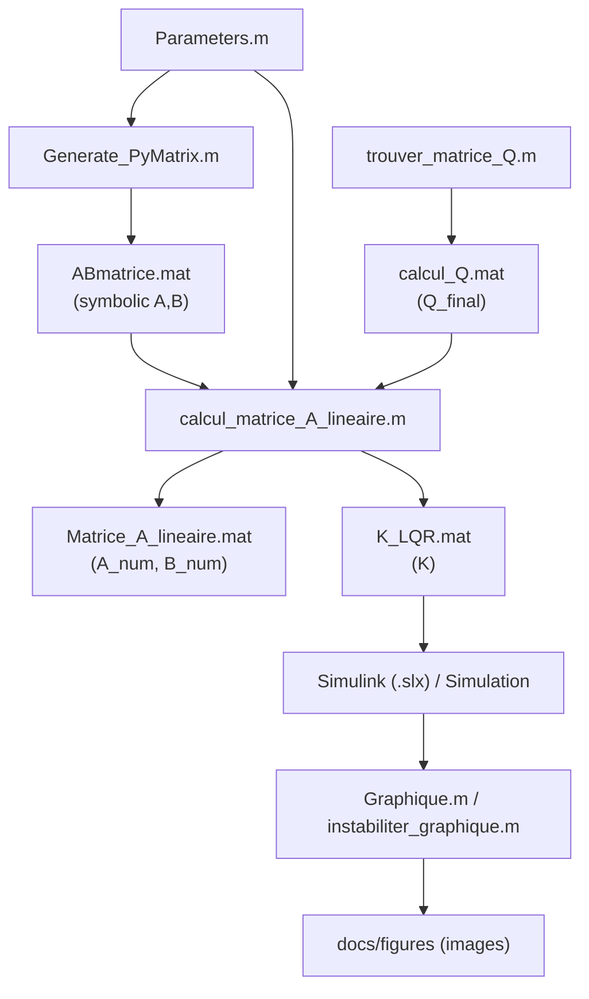

# Modélisation du contrôle du mini-sous-marin

Ce dépôt rassemble le modèle mathématique, la génération des matrices d'état, le calcul du retour LQR et les scripts de validation/visualisation utilisés autour des modèles Simulink du mini-sous-marin AUV développé à l'ASUQTR.

## Demarrage pour nouveaux arrivants

Si vous arrivez sur le projet pour la premiere fois, commencez ici:

- Guide pas-a-pas: [ONBOARDING.md](ONBOARDING.md)
- Setup projet MATLAB: [PROJECT_SETUP.md](PROJECT_SETUP.md)
- Cartographie du projet (actif vs archive): [PROJECT_MAP.md](PROJECT_MAP.md)
- Pipeline one-shot: `runWorkflow.m`

### Documentation par dossier (structure actuelle)

- Modele Simulink: [model/README.md](model/README.md)
- Callbacks modele: [model/callbacks/README.md](model/callbacks/README.md)
- Scripts (global): [scripts/README.md](scripts/README.md)
- Scripts de modelisation: [scripts/modeling/README.md](scripts/modeling/README.md)
- Scripts d'analyse: [scripts/analysis/README.md](scripts/analysis/README.md)
- Scripts de validation: [scripts/validation/README.md](scripts/validation/README.md)
- Donnees: [data/README.md](data/README.md)
- Documentation site/docs: [docs/README.md](docs/README.md)
- Archives historiques: [archive/README.md](archive/README.md)
- Ressources projet MATLAB: [resources/README.md](resources/README.md)

📘 **Documentation complète (équations rendues avec MathJax) :**
👉 [https://asuqtr.github.io/Matlab_Simulink/](https://asuqtr.github.io/Matlab_Simulink/)

> Si la page n'est pas accessible, activer GitHub Pages dans **Settings → Pages** (branche `Lewis_Cleaning`, dossier `/docs`).

---

## Points à retenir

- `Parameters.m` et `Generate_PyMatrix.m` portent le cœur de la modélisation.
- `calcul_matrice_A_lineaire.m` transforme le modèle symbolique en matrices numériques exploitables pour le contrôle.
- `trouver_matrice_Q.m` et `test_calculQ.m` servent à concevoir et valider la matrice de coût du LQR.
- Les scripts `Graphique.m`, `mouvement.m` et `instabiliter_graphique.m` sont des outils d'analyse et de présentation des résultats.
- Les fichiers `.slx` complètent la chaîne de simulation, mais la logique se trouve dans les scripts MATLAB.

## Structure actuelle et cible de nettoyage

La structure actuelle fonctionne, mais elle mélange encore les scripts source, les fichiers générés et les anciens essais. La prochaine étape logique consiste à mieux séparer ces rôles.

- `Parameters.m` peut être déplacé vers les callbacks du modèle Simulink `Modele_LQR_6DOF.slx` si l'objectif est d'initialiser automatiquement le modèle à l'ouverture ou au lancement de la simulation.
- Les fichiers `.mat` utilisés par la simulation doivent rester accessibles au modèle Simulink. Dans la pratique, cela peut vouloir dire les garder dans le même dossier que le `.slx`, ou les charger depuis un dossier de données explicite au démarrage du modèle.
- `Calcul_Inertie.m`, `test_calcalV2.m`, `testFinale.m` et les autres scripts de test anciens peuvent être regroupés dans un dossier d'archives ou de validation, afin de laisser le flux principal plus lisible.
- `test_calcalV2.m` semble être le point de référence le plus utile pour la mise au point de `Q`; les autres tests peuvent rester comme historique, mais ne devraient plus apparaître comme chemin principal dans la documentation.
- `Matrice_A_lineaire.mat`, généré par `calcul_matrice_A_lineaire.m`, peut être traité comme un artefact de calcul et non comme un fichier source.
- Les scripts de post-traitement (`Graphique.m`, `instabiliter_graphique.m`, `mouvement.m`) peuvent être regroupés dans une zone dédiée à l'analyse et à la visualisation.

En résumé, une arborescence plus propre pourrait distinguer au minimum : les scripts de modélisation, les scripts d'analyse, les artefacts générés, et les anciens essais conservés pour mémoire.

### Proposition de structure cible

Oui, on peut mettre le fichier Simulink principal dans un dossier `model/`. C'est même plus proche d'une structure standard en industrie : on sépare le modèle, les scripts source, les données générées, la documentation et les anciens essais.

Cette proposition garde le flux MATLAB/Simulink lisible tout en isolant les fichiers générés et les anciens essais.

```text
Matlab_Simulink/
├── model/
│   ├── Modele_LQR_6DOF.slx
│   └── callbacks/              # initialisation du modèle, chargement des paramètres
├── scripts/
│   ├── modeling/               # génération de A, B, Q et matrices associées
│   ├── analysis/               # Graphique.m, mouvement.m, instabiliter_graphique.m
│   └── validation/             # test_calcalV2.m et scripts de vérification utiles
├── data/
│   ├── generated/              # ABmatrice.mat, Matrice_A_lineaire.mat, calcul_Q.mat, K_LQR.mat
│   └── runtime/                # .mat nécessaires à l'exécution du modèle Simulink
├── docs/
└── archive/                    # anciens tests et scripts conservés pour mémoire
```

- Les scripts de modélisation restent séparés des scripts d'analyse pour éviter de mélanger calcul et visualisation.
- Les fichiers `.mat` générés sont documentés comme des sorties, pas comme des sources.
- Si `Parameters.m` est injecté dans le callback du `.slx`, le modèle peut charger ses paramètres au démarrage sans dépendre d'une exécution manuelle préalable.
- Les `.mat` requis par Simulink peuvent rester dans `data/runtime/` ou à côté du modèle si c'est plus simple pour le chargement.
- Les anciens scripts de test peuvent rester disponibles dans `archive/` sans polluer le chemin principal.

Dans cette logique, `Modele_LQR_6DOF.slx` devient le point d'entrée du dossier `model/`, et le reste du dépôt suit une séparation assez classique entre code, données et historique.

### Répartition concrète des fichiers actuels

Cette répartition reste une proposition de travail, mais elle donne une cible claire avant de déplacer les fichiers.

| Fichier actuel | Dossier cible | Rôle |
|---|---|---|
| `Modele_LQR_6DOF.slx` | `model/` | Modèle principal |
| `Modele_LQR_3DOF.slx` | `model/` ou `archive/` | Variante du modèle |
| `LQR block.slx` | `model/` ou `archive/` | Sous-modèle / bloc réutilisable |
| `Parameters.m` | `model/callbacks/` ou intégré au `.slx` | Initialisation des paramètres |
| `Generate_PyMatrix.m` | `scripts/modeling/` | Génération symbolique de `A` et `B` |
| `calcul_matrice_A_lineaire.m` | `scripts/modeling/` | Linéarisation numérique |
| `trouver_matrice_Q.m` | `scripts/modeling/` | Construction de `Q` |
| `test_calculQ.m` | `scripts/validation/` | Validation de `Q` et de `K` |
| `test_calcalV2.m` | `scripts/validation/` | Référence principale pour le réglage de `Q` |
| `Graphique.m` | `scripts/analysis/` | Post-traitement et tracés |
| `mouvement.m` | `scripts/analysis/` | Animation / visualisation |
| `instabiliter_graphique.m` | `scripts/analysis/` | Analyse de stabilité |
| `setax.m` | `scripts/analysis/` | Helper graphique appelé par le bloc MATLAB Function |
| `Calcul_Inertie.m` | `archive/` | Ancien script de calcul |
| `testFinale.m` | `archive/` | Ancien script de test |
| `signal_de_controle.m` | `archive/` | Ancien script de test |
| `ABmatrice.mat` | `data/generated/` | Sortie symbolique intermédiaire |
| `Matrice_A_lineaire.mat` | `data/generated/` | Sortie numérique intermédiaire |
| `calcul_Q.mat` | `data/generated/` | Matrice `Q` retenue |
| `K_LQR.mat` | `data/generated/` | Gain LQR |
| `info_simulation.mat` | `data/runtime/` ou `data/generated/` | Entrée de réglage / analyse |
| `resultats_stabilite.mat` | `data/generated/` | Résultats d'analyse de stabilité |
| `calcul_Q_possible1.mat` | `archive/` ou `data/generated/` | Ancien essai de `Q` |
| `calcul_Q_possible2.mat` | `archive/` ou `data/generated/` | Ancien essai de `Q` |
| `calcul_Q_possible3.mat` | `archive/` ou `data/generated/` | Ancien essai de `Q` |
| `Q_test1.mat` | `archive/` ou `data/generated/` | Ancien essai de `Q` |
| `signal1_test.mat` | `archive/` ou `data/generated/` | Ancien résultat de test |
| `sous marin en pentagone.mat` | `archive/` ou `data/generated/` | Ancien jeu de données / test |

- Les éléments placés dans `archive/` restent consultables, mais ils ne font plus partie du chemin nominal.
- Les fichiers placés dans `data/generated/` sont considérés comme des artefacts recalculables.
- Les fichiers utilisés au démarrage du modèle doivent rester dans un emplacement que Simulink peut charger sans ambiguïté.
- Le test principal avec les callbacks du modèle doit se faire dans `model/` autour de `Modele_LQR_6DOF.slx`, afin de valider l'initialisation et le chargement automatique des paramètres.

---

## Pipeline MATLAB (vue d'ensemble)



---

## Documentation détaillée

| Sujet | Lien |
|-------|------|
| Vue d'ensemble et fichiers clés | [docs/overview.md](docs/overview.md) |
| Théorie : espace d'état, stabilité, LQR, Riccati | [docs/theorie.md](docs/theorie.md) |
| Pipeline MATLAB et détail des scripts | [docs/pipeline-scripts.md](docs/pipeline-scripts.md) |
| Annexes (figures, références) | [docs/annexes.md](docs/annexes.md) |
