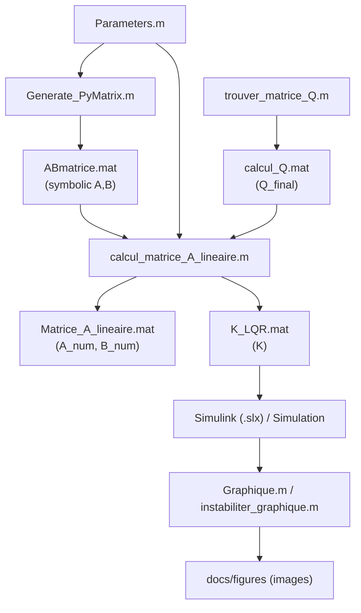

# Modélisation du contrôle du mini-sous-marin

Ce dépôt rassemble le modèle mathématique, la génération des matrices d'état, le calcul du retour LQR et les scripts de validation/visualisation utilisés autour des modèles Simulink du mini-sous-marin AUV développé à l'ASUQTR.

📘 **Documentation complète (équations rendues avec MathJax) :**
👉 [https://asuqtr.github.io/Matlab_Simulink/](https://asuqtr.github.io/Matlab_Simulink/)

> Si la page n'est pas accessible, activer GitHub Pages dans **Settings → Pages** (branche `Lewis_Cleaning`, dossier `/docs`).

---

## Points à retenir

- `Parameters.m` et `Generate_PyMatrix.m` portent le cœur de la modélisation.
- `calcul_matrice_A_lineaire.m` transforme le modèle symbolique en matrices numériques exploitables pour le contrôle.
- `trouver_matrice_Q.m` et `test_calculQ.m` servent à concevoir et valider la matrice de coût du LQR.
- Les scripts `Graphique.m`, `mouvement.m` et `instabiliter_graphique.m` sont des outils d'analyse et de présentation des résultats.
- Les fichiers `.slx` complètent la chaîne de simulation, mais la logique se trouve dans les scripts MATLAB.

---

## Pipeline MATLAB (vue d'ensemble)

---

## Documentation détaillée

| Sujet | Lien |
|-------|------|
| Vue d'ensemble et fichiers clés | [docs/overview.md](docs/overview.md) |
| Théorie : espace d'état, stabilité, LQR, Riccati | [docs/theorie.md](docs/theorie.md) |
| Pipeline MATLAB et détail des scripts | [docs/pipeline-scripts.md](docs/pipeline-scripts.md) |
| Annexes (figures, références) | [docs/annexes.md](docs/annexes.md) |
