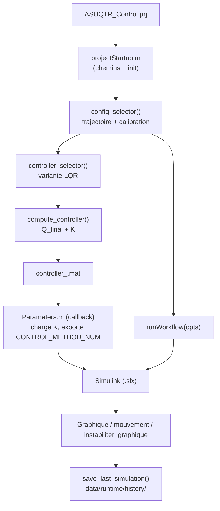

# Modélisation du contrôle du sous-marin

Ce dépôt rassemble le modèle mathématique, la génération des matrices d'état, le calcul du retour LQR et les scripts de validation/visualisation utilisés autour des modèles Simulink du sous-marin AUV développé à l'ASUQTR.

## Demarrage pour nouveaux arrivants

Si vous arrivez sur le projet pour la premiere fois, commencez ici:

- Guide pas-a-pas: [ONBOARDING.md](ONBOARDING.md)
- Setup projet MATLAB: [docs/PROJECT_SETUP.md](docs/PROJECT_SETUP.md)
- Cartographie du projet (actif vs archive): [PROJECT_MAP.md](PROJECT_MAP.md)
- Utilitaires ponctuels: [tools/README.md](tools/README.md)
- Pipeline one-shot: `runWorkflow.m`

### Documentation par dossier

- Modele Simulink: [model/README.md](model/README.md)
- Callbacks modele: [model/callbacks/README.md](model/callbacks/README.md)
- Scripts (global): [scripts/README.md](scripts/README.md)
- Scripts de modelisation: [scripts/modeling/README.md](scripts/modeling/README.md)
- Scripts d'analyse: [scripts/analysis/README.md](scripts/analysis/README.md)
- Scripts de validation: [scripts/validation/README.md](scripts/validation/README.md)
- Presets de simulation: [scripts/config/README.md](scripts/config/README.md)
- Tests formels: [tests/README.md](tests/README.md)
- Donnees: [data/README.md](data/README.md)
- Documentation site/docs: [docs/README.md](docs/README.md)
- Archives historiques: [archive/README.md](archive/README.md)
- Ressources projet MATLAB: [resources/README.md](resources/README.md)

📘 **Documentation complète (équations rendues avec MathJax) :**
👉 [https://asuqtr.github.io/Matlab_Simulink/](https://asuqtr.github.io/Matlab_Simulink/)

> Si la page n'est pas accessible, activer GitHub Pages dans **Settings → Pages** (branche `Lewis_Cleaning`, dossier `/docs`).

---

## Points à retenir

- Le workflow est **GUI-first** : ouvrir `ASUQTR_Control.prj`, puis utiliser `config_selector()`.
- `config_selector.m` + `controller_selector.m` remplacent les anciens scripts de configuration manuels.
- `compute_controller.m` calcule Q et K — les scripts `trouver_matrice_Q.m` et `calcul_matrice_A_lineaire.m` sont des références legacy documentées.
- Les sauvegardes de simulation sont **manuelles** via `save_last_simulation()` (pas automatiques).
- `Parameters.m` (callback modele) charge le bon controleur et exporte les variables workspace au demarrage de la simulation.

## Pipeline GUI (vue d'ensemble)

---

## Documentation détaillée

| Sujet | Lien |
|-------|------|
| Vue d'ensemble et fichiers clés | [docs/overview.md](docs/overview.md) |
| Théorie : espace d'état, stabilité, LQR, Riccati | [docs/theorie.md](docs/theorie.md) |
| Pipeline MATLAB et détail des scripts | [docs/pipeline-scripts.md](docs/pipeline-scripts.md) |
| Annexes (figures, références) | [docs/annexes.md](docs/annexes.md) |
